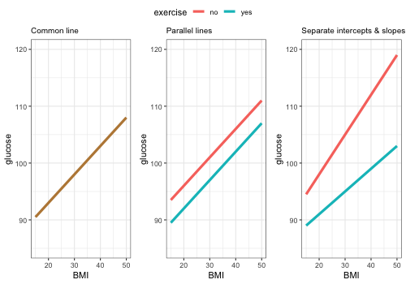

```{r setup, include = F}

knitr::opts_chunk$set(echo = F, fig.align = "center", 
                      fig.asp = 1,
                      echo = F, message = F, warning = F)

```


```{r xaringan-logo, echo = F}

library(xaringanExtra)

use_logo(
  image_url = "StatsCentralLogo_rmd.png",
  width = "110px",
  height = "128px",
  position = css_position(bottom = "-2.5em", left = "1em"),
  link_url = NULL,
  exclude_class = c("title-slide", "inverse", "hide_logo")
)

```


```{r echo = F, message = F}

library(RColorBrewer)
library(wordcloud)
library(tidyverse)
library(ggpubr)
library(GGally)
library(plotly)
library(reshape2)  ## For "acast"
library(png)

```


<style type="text/css">
.remark-slide-content {
  font-size: 28px;
  padding: 1em 1em 1em 1em;
}
</style>


# Background

-  Why think about link between $t$ test and regression?

```{r}

words_df <- read.csv("../data/stats_tests.csv", header = F)

{{wordcloud(words = words_df[ , 1], freq = words_df[ , 2],
          colors = brewer.pal(6, "Dark2"),
          random.color = T,
          scale = c(3, 1), rot.per = 1/4)}}

```

---


# Data: HERS (Hulley et al. 1998)

- Heart and Estrogen/progestin Replacement Study
- Randomised controlled trial
- Effect of estrogen/progestin on myocardial infarction and coronary heart disease events among older women
- Reported association between coronary heart diesase events and hormone use
- Conducted in the USA


Data from: 

Vittinghoff, E., 2012, *Regression Methods in Biostatistics*, Springer, 2nd ed. (https://regression.ucsf.edu)


---

# Data


Data has 37 variables from 2,763 subjects

```{r}

hers <- read.csv("../data/hersdata_ch3.csv")

## There are blanks in the data. Convert them to NAs

hers[hers == ""] <- NA

## Convert all character variables to factors

hers <- 
  hers %>%
  mutate(across(where(is.character), as.factor))

hers %>%
  select(HT, age, BMI, drinkany, exercise, diabetes, glucose) %>%
  str()

```


- Data for non-diabetics only will be used


```{r eval = F}

nom <- names(hers)[c(1, 2, 4, 5, 6, 7, 14, 18, 21, 28)]

nom_tbl <- data.frame(cbind(nom[1:5], nom[6:10]))

colnames(nom_tbl) <- NULL

print(nom_tbl, row.names = F)

```


---

# Modelling

- Modelling here is not how you would start modelling this data in a sensible way
- Sensible modelling starts with *research questions* and original *statistical analysis plan*
- Models here are only examples for today's topic


- Response variables we're looking at are continuous
- For these continuous response variables, model with normal distribution assumption makes sense

---

# Simple linear regression


```{r}

hers_no_diab <- 
  hers %>%
  filter(diabetes == "no")

```


```{r eval = F}

## Check for NAs

summary(hers_no_diab)

```


```{r}

## Remove rows with BMI values of NA

hers_no_diab <-
  hers_no_diab %>%
  filter(is.na(BMI) == F)

## Remove data point with glucose < 60 to make plots clearer

hers_no_diab <-
  hers_no_diab %>%
  filter(glucose > 60)

```

- One continuous response variable, one continuous explanatory variable

.pull-left[

- Y variable: glucose
- X variable: BMI (body mass index)

]

.pull-right[

```{r fig.width = 5, fig.height = 5}

ggplot(hers_no_diab, aes(x = BMI, y = glucose)) +
  geom_point() +
  theme_bw()

```

]


---

# Simple linear regression

```{r}

glu.lm1 <- lm(glucose ~ BMI, data = hers_no_diab)

```


*Assumptions:* Check constant variance and normal distribution. OK!


```{r}

res.glu1 <- data.frame(res = residuals(glu.lm1))

res.fit.glu1 <- data.frame(res = res.glu1$res,
                           fit = fitted(glu.lm1))

```


.pull-left[

```{r}

ggplot(res.fit.glu1, aes(x = fit, y = res)) +
  geom_point() +
  geom_hline(yintercept = 0, colour = "blue") +
  theme_bw()

```

]


.pull-right[

```{r}

ggplot(res.glu1, aes(sample = res)) +
  stat_qq() +
  stat_qq_line() +
  theme_bw()

```

]


```{r fig.width = 6, fig.height = 6, eval = F}

res.glu1 <- data.frame(res = residuals(glu.lm1))

res.fit.glu1 <- data.frame(res = res.glu1$res,
                           fit = fitted(glu.lm1))

glu1_p1 <- ggplot(res.fit.glu1, aes(x = fit, y = res)) +
  geom_point() +
  geom_hline(yintercept = 0, colour = "blue") +
  theme_bw()
  
glu1_p2 <- ggplot(res.glu1, aes(sample = res)) +
  stat_qq() +
  stat_qq_line() +
  theme_bw()

ggarrange(glu1_p1, glu1_p2)

#par(mfrow = c(1, 2))
#{{plot(glu.lm1, which = 1)}}
#{{plot(glu.lm1, which = 2)}}
#par(mfrow = c(1, 1))
    
```


---

# Simple linear regression  
  

```{r}

round(summary(glu.lm1)$coef, digits = 4)

```

Model equation:

$$\small Y = \beta_0 + \beta_1 X_1$$

$$\small \mathrm{glucose} = 83.3 + 0.48 \: \mathrm{BMI}$$

---

# Simple linear regression

```{r out.width = "60%", message = F}

glu1_p3 <- ggplot(hers_no_diab, aes(x = BMI, y = glucose)) +
  geom_point() +
  geom_smooth(method = "lm", se = F) +
  theme_bw()

suppressMessages(print(glu1_p3))

```

---

# Simple linear regression

.pull-left[

What can we do with our model?

-  Predict glucose from BMI

- If BMI = 40, what is the predicted glucose level?

$$\small \mathrm{glucose} =  83.3 + 0.48 \times 40 = 103$$
]


.pull-right[

```{r message = F}

pred_df1 <- data.frame(x1 = 40, y1 = 65, x2 = 40, y2 = 103)

pred_df2 <- data.frame(x1 = 12, y1 = 103, x2 = 40, y2 = 103)

glu1_p4 <- glu1_p3 + 
  geom_segment(aes(x = x1, y = y1, xend = x2, yend = y2), 
               data = pred_df1, linetype = "dashed", 
               colour = "red") +
  geom_segment(aes(x = x1, y = y1, xend = x2, yend = y2), 
               data = pred_df2, linetype = "dashed", 
               colour = "red")

suppressMessages(print(glu1_p4))
  
```

]


---

# Multivariable linear regression

- Possibly *age* has an effect on glucose levels as well as BMI
- Add *age* (continuous variable) to model

```{r fig.width = 6, fig.height = 6, message = F}

hers_no_diab %>%
  select(age, BMI, glucose) %>%
  ggpairs() +
  theme_bw()

```


---

# Multivariable linear regression

```{r}

glu.lm2 <- lm(glucose ~ age + BMI, data = hers_no_diab)

round(summary(glu.lm2)$coef, digits = 4)

```


## Model equation


$$\small Y = \beta_0 + \beta_1 X_1 + \beta_2 X_2$$


$$\small \mathrm{glucose} = 79.2 + 0.06 \: \mathrm{age} + 0.50 \: \mathrm{BMI}$$

---

# Multivariable linear regression

Fitted model with data

```{r}

xx <- seq(min(hers_no_diab$age), max(hers_no_diab$age),
          length.out = 100)

yy <- seq(min(hers_no_diab$BMI), max(hers_no_diab$BMI),
          length.out = 100)

surf_df <- expand.grid(age = xx, BMI = yy)

surf_df$glucose <- predict.lm(glu.lm2, newdata = surf_df)

## Rearrange x, y and z values into a matrix with "acast" 
##   from "reshape2" (i.e. recast it as an array)

surf_mat <- acast(surf_df, BMI ~ age, value.var = "glucose") 
## y ~ x

```


```{r}

## Construct plot of data points

p_glu_age_bmi <- plot_ly(hers_no_diab,
  x = ~ age,
  y = ~ BMI,
  z = ~ glucose,
  type = "scatter3d",
  mode = "markers",
  size = 1, opacity = 0.3)

## Add fitted model surface

p_glu_age_bmi <- add_trace(
  p = p_glu_age_bmi,
  z = surf_mat,
  x = xx,
  y = yy,
  type = "surface")

p_glu_age_bmi

```


---

# Multivariable linear regression

Model equation

$$\small \mathrm{glucose} = 79.2 + 0.06 \: \mathrm{age} + 0.50 \: \mathrm{BMI}$$

-  Person who is 60 years old with BMI of 40: glucose = 102

$$\small \mathrm{glucose} = 79.2 + 0.06 \times 60 + 0.50 \times 40 = 102$$

---

# Multivariable linear regression

-  Does exercise affect glucose level while adjusting for BMI?

```{r}

glu3_p1 <- ggplot(hers_no_diab, aes(x = BMI, y = glucose, 
                                    colour = exercise)) +
  geom_point() +
  theme_bw()

suppressMessages(print(glu3_p1))

```


---

# Multivariable linear regression

How do BMI and exercise fit together in their effect on glucose?

```{r eval = F}

## Make this graph and then put "eval = F"!

bmi <- seq(from = 15, to = 50, length.out = 70)


glu_comm <- 83 + 0.5 * bmi

glu_para_ex_n <- 86 + 0.5 * bmi

glu_para_ex_y <- 82 + 0.5 * bmi

glu_sep_ex_n <- 85 + 0.7 * bmi

glu_sep_ex_y <- 81 + 0.4 * bmi


df_comm <- data.frame(BMI = bmi, glucose = glu_comm)

df_para <- data.frame(BMI = c(bmi, bmi), 
                      glucose = c(glu_para_ex_n, glu_para_ex_y),
                      exercise = rep(c("no", "yes"), each = 70))

df_para$exercise <- factor(df_para$exercise)

df_sep <- data.frame(BMI = c(bmi, bmi), 
                      glucose = c(glu_sep_ex_n, glu_sep_ex_y),
                      exercise = rep(c("no", "yes"), each = 70))

df_sep$exercise <- factor(df_sep$exercise)

p_comm <- 
  ggplot(df_comm, aes(x = BMI, y = glucose)) +
  geom_line(colour = "#bb8844", size = 1.5) +
  ylim(85, 120) +
  ggtitle("Common line") +
  theme_bw() +
  theme(plot.title = element_text(size = 10))

p_para <- 
  ggplot(df_para, aes(x = BMI, y = glucose, colour = exercise)) +
  geom_line(size = 1.5) +
  ylim(85, 120) +
  ggtitle("Parallel lines") +
  theme_bw() +
  theme(plot.title = element_text(size = 10)) +
  theme(legend.position = "none")

p_sep <- 
  ggplot(df_sep, aes(x = BMI, y = glucose, colour = exercise)) +
  geom_line(size = 1.5) +
  ylim(85, 120) +
  ggtitle("Separate intercepts & slopes") +
  theme_bw() +
  theme(plot.title = element_text(size = 10))

png(filename = "p_all_reg.png",
    width = 500, height = 350)

ggarrange(p_comm, p_para, p_sep, ncol = 3, common.legend = T)

dev.off()

```


.center[]

---

# Multivariable linear regression

-  We'll model the relationship with parallel lines
-  Model equation - two predictor variables:
    -  BMI - continuous
    -  exercise - categorical (no/yes coded as 0/1)
    
$$\small \mathrm{glucose} = \beta_0 + \beta_1 \: \mathrm{BMI} + \beta_2 \: \mathrm{exer}_{\mathrm{yes}}$$
For exercise = no (i.e. 0): $$\small \mathrm{glucose} = \beta_0 + \beta_1 \: \mathrm{BMI}$$

For exercise = yes (i.e. 1):$$\small \mathrm{glucose} = \beta_0 + \beta_1 \: \mathrm{BMI} + \beta_2 \;\;\; \mathrm{or} \;\;\; \mathrm{glucose} = (\beta_0 + \beta_2) + \beta_1 \: \mathrm{BMI}$$

---

# Multivariable linear regression


```{r}

glu.lm3 <- lm(glucose ~ BMI + exercise, data = hers_no_diab)

round(summary(glu.lm3)$coef[ , -c(4:5)], digits = 3)

```


For exercise = no (i.e. 0): $$\small \mathrm{glucose} = 84.0 + 0.47 \: \mathrm{BMI}$$

For exercise = yes (i.e. 1):$$\small \mathrm{glucose} = 84.02 + 0.47 \: \mathrm{BMI} - 0.87 \;\;\; \mathrm{or} \;\;\; \mathrm{glucose} = 83.2 + 0.47 \: \mathrm{BMI}$$

---

# Predictor: categorical, two groups

Does exercise alone affect glucose level?


```{r}

ggplot(hers_no_diab, aes(x = exercise, y = glucose)) +
  geom_boxplot(outlier.shape = NA) +  
  # avoid plotting outliers twice
  geom_jitter(position = position_jitter(width = 0.3, height = 0),
              alpha = 0.3) +
  theme_bw()

```


---

# Predictor: categorical, two groups


-  Y variable: glucose
-  X variable: exercise - categorical (no/yes coded as 0/1)

Model equation

$$\small \mathrm{glucose} = \beta_0 + \beta_1 \: \mathrm{exer}_{\mathrm{yes}}$$

```{r}

glu.lm4 <- lm(glucose ~ exercise, data = hers_no_diab)

round(summary(glu.lm4)$coef[ , -c(4:5)], digits = 3)

```

For exercise = no: $\;\;$ Est. mean glucose = 97.4

For exercise = yes: $\;$ Est. mean glucose = 97.37 - 1.64 = 95.7

---

# Predictor: categorical, two groups

$t$ test

```{r}

t.test(glucose ~ exercise, data = hers_no_diab, var.equal = T)

```


---

# References

Hulley, S. et al, 1998, Randomized trial of estrogen plus progestin for secondary prevention of coronary heart disease in postmenopausal women, *Journal of the American Medical Association* 280(7) 605-613
